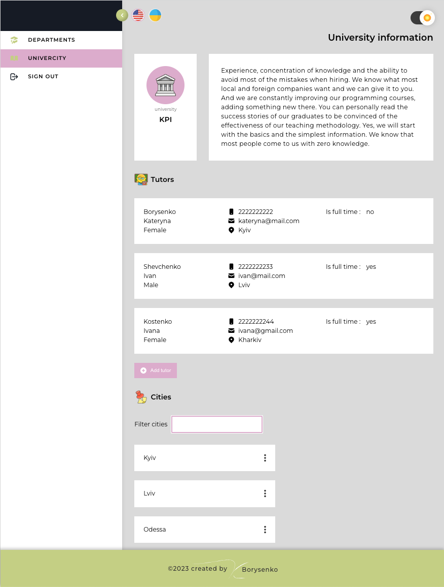
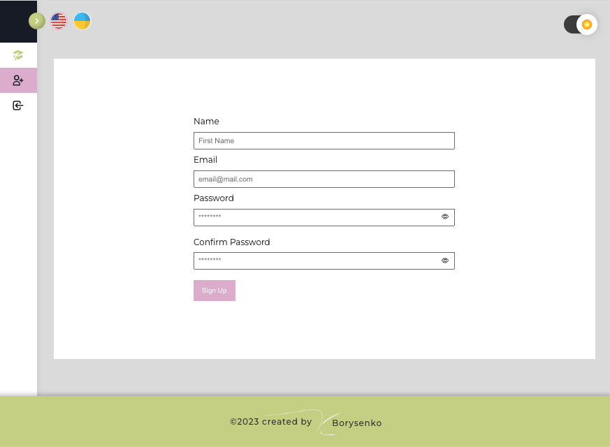

# `University with React Redux Redux-thunk`

## To watch video click to the building

 
 
 

<!--
решение проблемы с УТЕЧКОЙ ПАМЯТИ

пошагово как выполнить
https://github.com/Kateryna-Borysenko/tanya-melnyk-BC-12_React-course/blob/lesson-6_rest-api/src/lessons/plan_6.md

 1 способ с массой проверок  https://www.youtube.com/watch?v=KyQIovGxbms&list=PLViULGko0Fdg1tLKYc1KMrdMrEjPvOa9O&index=110

 2й способ более продвинутый AbortController/ - https://www.youtube.com/watch?v=KyQIovGxbms&list=PLViULGko0Fdg1tLKYc1KMrdMrEjPvOa9O&index=109

-->
